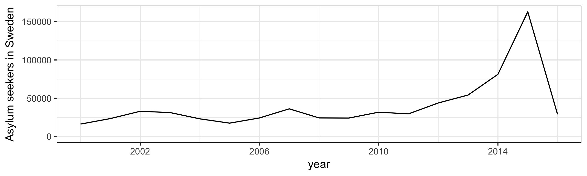
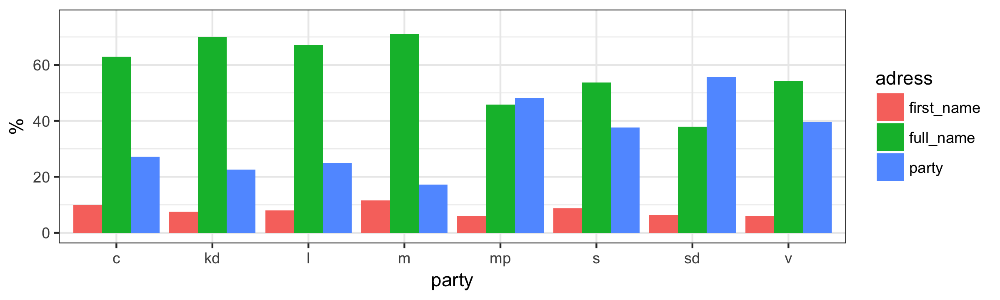

class: middle

# Bakgrund: ökat intresse för textanalys
- Nya statistiska metoder 
- Bättre statistikprogram
- Fler datamängder tillgängliga

---
class: inverse, middle, center

#<a href="https://data.riksdagen.se/" target="_blank">Öppna data från Sveriges riksdag</a>

---

# Ett par exempel på tidigare forskning utifrån data från riksdagen:
- Bäck, H., M. Debus & J. Müller (2014) "Who Takes the Parliamentary Floor? The Role of Gender in Speech-making in the Swedish Riksdag", *Political Research Quarterly*, 67: 504–-518.

- Kapitel i Lindvall, J., Bäck, H., Dahlström, C., Naurin, E. & Teorell, J. (2017). *Samverkan och strid i den parlamentariska demokratin*. Stockholm: SNS förlag 

---
class: inverse, center, middle

#Hur har de etablerade partierna agerat efter att Sverigedemokraterna kommit in i riksdagen?

---
class: left, middle

# Strategier för etablerade partier

Meguid (2008) menar att etablerade partier kan förhålla sig till utmanarpartier på 3 sätt:

--

1. Avvisande (Dismissive)

--

2. Anpassande (Accommodative)

--

3. Konfrontatorisk (Adversarial)

---
```{r include=FALSE}
library(tidyverse)
library(knitr)
library(kableExtra)
strategier <- tribble(
    ~Strategy, ~Agenda, ~Framing, ~Interaction,  
    "Dismissive", "No change", "No change", "No interaction",
    "Accommodative", "Increase", "Similar framing", "Social closeness",
    "Adversarial","Increase","Different framing", "Social distance"
)
```

#Strategier och förväntat utfall
```{r echo = FALSE,  results = 'asis' }

kable(strategier, format = "html")

```


---
class: left, middle

# Data och metod
- Debatter i riksdagen 1994&ndash;2017
- 300 000 debattinlägg och 50 miljoner tokens
- Styrd ("seeded") topic model + sentimentlexikon

---
#Kontext
- Sverigedemokraterna kommer in i riksdagen 2010
- Regeringsskifte 2014
--

---
class: inverse, center, middle

# Resultat

---
# Agenda

---
# Agenda


---
# Framing


---
# Interaction


---
# Interaction (2010&ndash;2014)


---
# Interaction (2010&ndash;2014)


---
#Robusthetstester
- Energi som ämne istället för invandring
- Olika initialiseringar för modellerna
- Val av fasta ord 

---
#Slutsatser
- Invandring diskuterades mer i partiledardebatter efter SD:s inträde, men inte i övriga debatter.
- Flyktingkrisen 2015 ledde till att invandring fick ett större genomslag i riksdagsdebatterna.
- De etablerade partierna talar inte om invandring på samma sätt som SD.
- Och de ignorerar inte SD i debatterna. 

